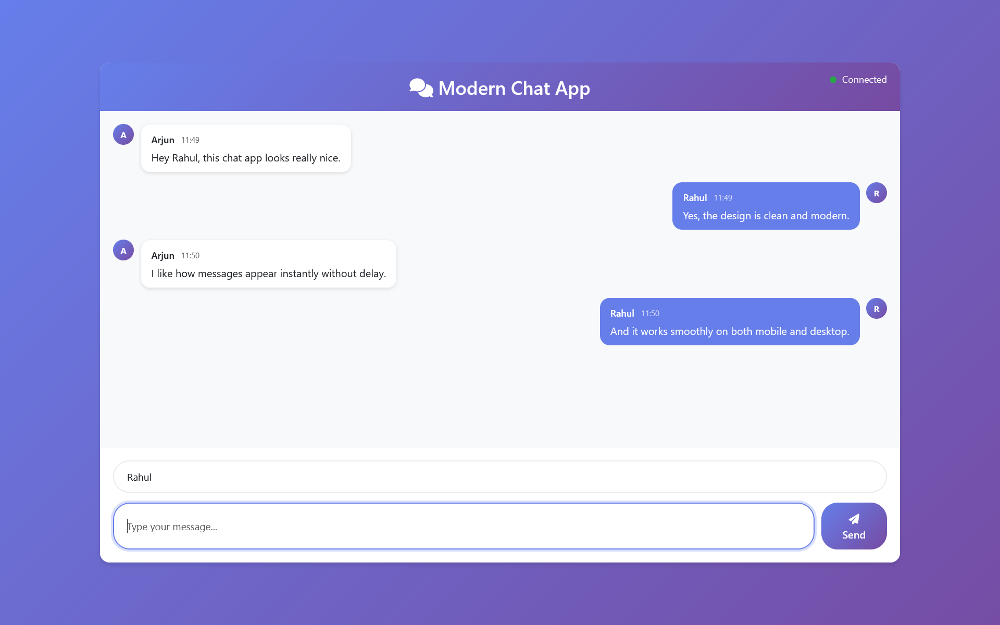
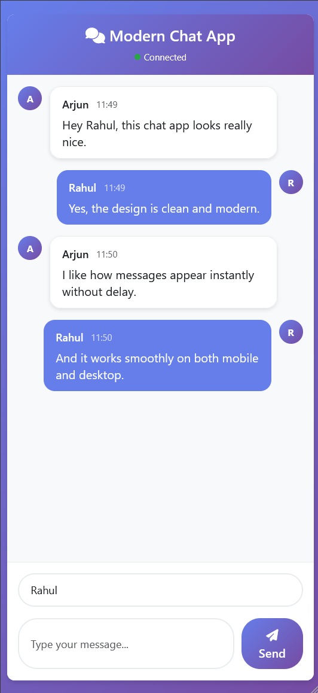

#  Modern Real-Time Chat Application

A beautiful, responsive real-time chat application built with Spring Boot and modern web technologies. Features a sleek UI with gradient backgrounds, user avatars, timestamps, and real-time messaging capabilities.


##  Features

###  **Modern UI/UX**

- **Beautiful Design**: Gradient backgrounds, glassmorphism effects, and smooth animations
- **Responsive Layout**: Fully responsive design that works on desktop, tablet, and mobile
- **User Avatars**: Automatic avatar generation with user initials
- **Message Bubbles**: Different styles for own vs. other messages
- **Timestamps**: Real-time timestamps for all messages
- **Connection Status**: Live connection indicator with visual feedback

###  **Real-Time Features**

- **Instant Messaging**: WebSocket-based real-time communication
- **Live Connection**: Automatic reconnection on connection loss
- **Message Broadcasting**: Messages sent to all connected users instantly
- **Input Validation**: Real-time validation and user feedback
- **Keyboard Shortcuts**: Press Enter to send messages quickly

###  **Mobile Optimized**

- **Touch-Friendly**: Optimized for mobile devices
- **Responsive Breakpoints**: Different layouts for different screen sizes
- **Mobile-First Design**: Designed with mobile users in mind

## Technologies Used

### **Backend**

- **Java 17** - Modern Java features
- **Spring Boot 3.5.3** - Rapid application development
- **Spring WebSocket** - Real-time communication
- **STOMP Protocol** - Message-oriented middleware
- **Maven** - Dependency management

### **Frontend**

- **HTML5 & CSS3** - Modern web standards
- **Bootstrap 5.3.7** - Responsive UI framework
- **Font Awesome 6.4.0** - Beautiful icons
- **SockJS** - WebSocket fallback support
- **STOMP.js** - STOMP protocol implementation
- **Vanilla JavaScript** - No framework dependencies

##  Quick Start

### Prerequisites

- **Java 17+** - [Download here](https://adoptium.net/)
- **Maven 3.6+** - [Download here](https://maven.apache.org/download.cgi)
- **Git** - [Download here](https://git-scm.com/)

### Installation & Setup

1. **Clone the repository**

   ```bash
   git clone https://github.com/yourusername/chat-app.git
   cd chat-app
   ```

2. **Build the application**

   ```bash
   ./mvnw clean package
   ```

3. **Run the application**

   ```bash
   ./mvnw spring-boot:run
   ```

4. **Access the chat**
   Open your browser and navigate to: [http://localhost:8080/chat](http://localhost:8080/chat)

##  Usage Guide

### **Getting Started**

1. **Enter Your Name**: Type your name in the "Enter your name..." field
2. **Start Chatting**: Type your message and press Enter or click Send
3. **Real-Time Updates**: See messages from other users instantly

### **Features Overview**

- **Connection Status**: Green dot = Connected, Yellow = Connecting, Red = Disconnected
- **Message Bubbles**: Your messages appear on the right (blue), others on the left (white)
- **User Avatars**: Each user gets a unique avatar with their initial
- **Timestamps**: See exactly when each message was sent
- **Responsive Design**: Works perfectly on any device size

## 📄 Project Structure

```
chat-app/
├── src/
│ └── main/
│ ├── java/com/chat/app/
│ │ ├── AppApplication.java # Spring Boot main class
│ │ ├── controller/ChatController.java # WebSocket handler
│ │ ├── model/ChatMessage.java # Message data model
│ │ └── config/WebSocketConfig.java # WebSocket configuration
│ └── resources/
│ ├── static/js/script.js # WebSocket frontend logic
│ ├── templates/chat.html # Chat UI template
│ └── application.properties # App configuration
├── pom.xml # Maven dependencies
└── README.md # Documentation
```

## Deployment Options

### **Railway (Recommended - Easiest)**

1. Go to [railway.app](https://railway.app)
2. Sign up with GitHub
3. Click "Deploy from GitHub repo"
4. Select your repository
5. Railway auto-detects Spring Boot and deploys
6. Get your live URL instantly!

### **Render (Free Tier Available)**

1. Go to [render.com](https://render.com)
2. Sign up with GitHub
3. Create new "Web Service"
4. Connect your repository
5. Use these settings:
   - **Build Command**: `./mvnw clean package -DskipTests`
   - **Start Command**: `java -jar target/app-0.0.1-SNAPSHOT.jar`
6. Deploy!

### **Heroku (Paid)**

1. Install Heroku CLI
2. Create `Procfile`: `web: java -jar target/app-0.0.1-SNAPSHOT.jar`
3. Run: `heroku create your-app-name`
4. Run: `git push heroku main`

## UI Screenshots

### Desktop View



### Mobile View




## Configuration

### **Environment Variables**

- `PORT` - Server port (default: 8080)
- `SPRING_PROFILES_ACTIVE` - Active profile (default: dev)

### **WebSocket Configuration**

The app uses STOMP over SockJS for reliable WebSocket communication:

- **Endpoint**: `/chat`
- **Message Destination**: `/app/sendMessage`
- **Topic**: `/topic/messages`

## Performance Features

- **Automatic Reconnection**: Handles network interruptions gracefully
- **Message Validation**: Prevents empty messages and validates input
- **Responsive Design**: Optimized for all screen sizes
- **Efficient Rendering**: Smooth animations and transitions
- **Memory Management**: Proper cleanup on page unload

## Contributing

1. Fork the repository
2. Create a feature branch: `git checkout -b feature/amazing-feature`
3. Commit your changes: `git commit -m 'Add amazing feature'`
4. Push to the branch: `git push origin feature/amazing-feature`
5. Open a Pull Request

## License

This project is licensed under the MIT License - see the [LICENSE](LICENSE) file for details.

## Acknowledgments

- **Spring Boot Team** - For the amazing framework
- **Bootstrap Team** - For the responsive UI framework
- **Font Awesome** - For the beautiful icons
- **SockJS & STOMP.js** - For reliable WebSocket communication

## Support

If you have any questions or need help:

1. **Check the Issues** - Look for existing solutions
2. **Create an Issue** - Describe your problem
3. **Contact** - Reach out via GitHub

---
